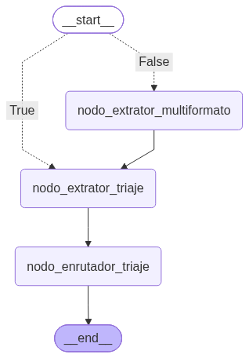

# G10-LATAM-EQUIPO17-MediFlow

# MediFlow - Agente Autónomo  para Triaje, Extracción y Enrutamiento de  Documentos Clínicos

## Descripción del Proyecto

MediFlow es una solución de software inteligente diseñada para automatizar el procesamiento de documentos clínicos y administrativos en el sector salud. Implementa un **agente inteligente y autónomo** capaz de recibir documentos en múltiples formatos (PDFs digitalizados, imágenes de estudios/recetas o texto plano), clasificarlos automáticamente, extraer entidades y datos clínicos esenciales con alta precisión y enrutarlos a su destino correspondiente sin intervención manual en los casos estándar.

### **MediFlow Resuelve Desafíos Complejos como:**

* Visión multimodal.
* Extracción estructurada de datos clínicos.
* Lógica de decisión condicional y manejo de casos ambiguos o urgentes (como datos ilegibles,
  prescripciones de alto riesgo o solicitudes de urgencia).

## Arquitectura

El sistema se implementará bajo una Arquitectura RESTful, dividiendo la solución en dos entidades completamente independientes: Cliente (Frontend) y Servidor (Backend). Esta separación garantiza que cada módulo pueda evolucionar, mantenerse y escalar de forma autónoma según las exigencias del entorno.

### **Principios Clave de la Arquitectura:**

* **Especialización del Cliente (Frontend):** Permite construir interfaces de usuario avanzadas, reactivas y amigables, enfocadas en ofrecer la mejor experiencia posible al personal médico y de auditoría.

* **Especialización del Servidor (Backend):** Concentra la lógica de negocio, la orquestación del agente inteligente de IA y la integración con servicios en la nube, exponiendo sus capacidades mediante recursos y endpoints estandarizados.

* **Escalabilidad Independiente:** Al estar desacoplados, es posible escalar el servidor sin afectar el cliente o viceversa.

## Frontend

### Tecnologías

<table>
  <thead>
    <tr>
      <th>Tecnología</th>
      <th>Descripción</th>
    </tr>
  </thead>
  <tbody>
    <tr>
      <td><strong>React 19</strong></td>
      <td>Biblioteca principal utilizada para construir la interfaz de usuario.</td>
    </tr>
    <tr>
      <td><strong>Vite 8</strong></td>
      <td>Herramienta utilizada para el desarrollo y compilación del proyecto frontend.</td>
    </tr>
    <tr>
      <td><strong>JavaScript y JSX</strong></td>
      <td>Lenguaje y sintaxis utilizados para desarrollar los componentes de la aplicación.</td>
    </tr>
    <tr>
      <td><strong>React DOM</strong></td>
      <td>Permite integrar React con el DOM del navegador para renderizar la interfaz.</td>
    </tr>
    <tr>
      <td><strong>Oxlint</strong></td>
      <td>Herramienta de análisis estático utilizada para revisar la calidad y consistencia del código.</td>
    </tr>
  </tbody>
</table>

### Estructura de Carpetas

```text
frontend/
├── index.html
├── package.json
├── vite.config.js
├── .oxlintrc.json
└── src/
    ├── main.jsx
    ├── App.jsx
    ├── App.css
    ├── index.css
    ├── app/                          # Capa transversal (guards, layouts, navegación, sesión)
    │   ├── icons.jsx
    │   ├── navigation.jsx
    │   ├── session.js
    │   ├── guards/
    │   └── layouts/
    ├── modules/                      # Módulos por dominio (Screaming Architecture)
    │   ├── <modulo>/                 # Estructura interna: components/, pages/, services/, types/
    │   ├── agent/
    │   ├── auth/
    │   ├── dashboard/
    │   ├── document-processing/
    │   ├── documents/
    │   ├── landing/
    │   ├── profile/
    │   ├── storage/
    │   └── users/
    └── shared/                       # Recursos compartidos reutilizables (ui, api, assets)
        ├── api/
        ├── assets/
        └── ui/
```

## Backend

### Tecnologías

<table>
  <thead>
    <tr>
      <th>Categoría</th>
      <th>Tecnología</th>
      <th>Descripción</th>
    </tr>
  </thead>
  <tbody>
    <tr>
      <td rowspan="6" align="center"><strong>Servidor y configuraciones</strong></td>
      <td><strong>Python</strong></td>
      <td>Lenguaje principal utilizado para desarrollar el backend y la lógica de la aplicación.</td>
    </tr>
    <tr>
      <td><strong>FastAPI</strong></td>
      <td>Framework utilizado para crear la API REST del backend de forma rápida y eficiente.</td>
    </tr>
    <tr>
      <td><strong>Uvicorn</strong></td>
      <td>Servidor ASGI utilizado para ejecutar la aplicación FastAPI.</td>
    </tr>
    <tr>
      <td><strong>Pydantic</strong></td>
      <td>Librería utilizada para validar, estructurar y manejar los datos de la aplicación.</td>
    </tr>
    <tr>
      <td><strong>Pydantic Settings</strong></td>
      <td>Permite gestionar la configuración de la aplicación y las variables de entorno.</td>
    </tr>
    <tr>
      <td><strong>Python Multipart</strong></td>
      <td>Permite recibir y procesar archivos enviados mediante formularios HTTP.</td>
    </tr>
    <tr>
      <td rowspan="2" align="center"><strong>Seguridad y autenticación</strong></td>
      <td><strong>PyJWT</strong></td>
      <td>Implementa JSON Web Tokens (JWT) para la autenticación y autorización de usuarios.</td>
    </tr>
    <tr>
      <td><strong>pwdlib + Argon2</strong></td>
      <td>Se utiliza para proteger las contraseñas mediante hashing seguro con el algoritmo Argon2.</td>
    </tr>
    <tr>
      <td rowspan="3" align="center"><strong>Base de datos</strong></td>
      <td><strong>SQLAlchemy 2.0 (async)</strong></td>
      <td>ORM asíncrono para modelado de entidades y consultas a la base de datos.</td>
    </tr>
    <tr>
      <td><strong>aiosqlite</strong></td>
      <td>Driver asíncrono de SQLite para desarrollo local.</td>
    </tr>
    <tr>
      <td><strong>asyncpg</strong></td>
      <td>Driver asíncrono de PostgreSQL para entornos de producción.</td>
    </tr>
    <tr>
      <td rowspan="7" align="center"><strong>Inteligencia Artificial</strong></td>
      <td><strong>LangChain</strong></td>
      <td>Framework para desarrollar aplicaciones basadas en modelos de lenguaje e integrar herramientas y datos externos.</td>
    </tr>
    <tr>
      <td><strong>LangChain Core</strong></td>
      <td>Proporciona los componentes fundamentales para construir aplicaciones con modelos de lenguaje.</td>
    </tr>
    <tr>
      <td><strong>LangChain Community</strong></td>
      <td>Incluye integraciones con diferentes herramientas, servicios y fuentes de datos.</td>
    </tr>
    <tr>
      <td><strong>LangChain Google GenAI</strong></td>
      <td>Permite integrar modelos de inteligencia artificial de Google Gemini mediante LangChain.</td>
    </tr>
    <tr>
      <td><strong>LangChain Groq</strong></td>
      <td>Permite utilizar modelos de lenguaje ejecutados mediante la infraestructura de Groq.</td>
    </tr>
    <tr>
      <td><strong>LangGraph</strong></td>
      <td>Framework para crear agentes y flujos de trabajo de IA mediante estructuras basadas en grafos.</td>
    </tr>
    <tr>
      <td><strong>Graphviz</strong></td>
      <td>Permite generar y visualizar gráficamente los flujos y estructuras de grafos.</td>
    </tr>
    <tr>
      <td rowspan="2" align="center"><strong>Procesamiento de archivos</strong></td>
      <td><strong>PyMuPDF</strong></td>
      <td>Librería utilizada para leer, extraer texto y procesar documentos PDF.</td>
    </tr>
    <tr>
      <td><strong>Pillow</strong></td>
      <td>Librería utilizada para abrir, manipular y procesar imágenes en diferentes formatos.</td>
    </tr>
    <tr>
      <td align="center"><strong>Cloud</strong></td>
      <td><strong>OCI (Oracle Cloud Infrastructure)</strong></td>
      <td>SDK de Oracle Cloud utilizado para interactuar con servicios de almacenamiento de objetos.</td>
    </tr>
  </tbody>
</table>

### Flujo de Triaje

El pipeline de procesamiento sigue un flujo secuencial orquestado por **LangGraph**:

<p align="center">
  
</p>

#### Nodos del Grafo

| Nodo | Responsabilidad |
|------|-----------------|
| **`START` / `get_es_texto`** | Evalúa condicionalmente la entrada: si es texto plano salta directo al triaje; si es archivo binario, lo deriva al extractor multiformato. |
| **`nodo_extrator_multiformato`** | Lee y procesa el archivo físico (PyMuPDF para PDFs o modelo multimodal de visión para imágenes JPG/PNG). |
| **`nodo_extrator_triaje`** | Clasifica el documento (tipo, especialidad, urgencia) y extrae entidades clínicas estructuradas (paciente, CIE-10, medicamentos, score de confianza) con Google Gemini. |
| **`nodo_enrutador_triaje`** | Compara el score contra el umbral (`>= 0.75`), decide el destino (emergencia, farmacia, auditoría), sube el archivo a OCI Object Storage y persiste el `RegistroTriaje` en base de datos. |
| **`END`** | Ensambla y retorna el payload final estructurado (`RespuestaTriaje`) al cliente. |

```text
Documento (PDF/imagen/texto)
        │
        ▼
  Clasificación ──► Tipo de documento + Especialidad + Nivel de prioridad
        │
        ▼
  Extracción ──► Datos del paciente, médico, diagnóstico, CIE-10, medicamentos
        │
        ▼
  Enrutamiento ──► Destino (Cola de emergencia, Farmacia, Auditoría, etc.)
        │
        ▼
  Almacenamiento ──► OCI Object Storage (documento original + resultado JSON)
        │
        ▼
  Registro ──► Base de datos (RegistroTriaje vinculado al usuario)
```

Los documentos con score de confianza inferior a `UMBRAL_CONFIANZA_MINIMO` (default: `0.75`) son derivados automáticamente al bucket de auditoría humana.

### Endpoints de la API

La documentación interactiva (Swagger UI) está disponible en `/docs` cuando el servidor está en ejecución.

| Método | Ruta | Descripción | Acceso |
|--------|------|-------------|--------|
| `POST` | `/auth/registro` | Registrar nuevo usuario | Público |
| `POST` | `/auth/login` | Iniciar sesión | Público |
| `POST` | `/auth/refresh` | Renovar tokens | Autenticado |
| `POST` | `/auth/logout` | Cerrar sesión (revoca refresh token) | Autenticado |
| `GET` | `/auth/me` | Perfil del usuario autenticado | Autenticado |
| `GET` | `/auth/usuarios` | Listar todos los usuarios | Admin |
| `PATCH` | `/auth/usuarios/{id}/rol` | Cambiar rol de un usuario | Admin |
| `POST` | `/triaje/` | Procesar triaje de texto | Paciente, Médico, Admin |
| `POST` | `/triaje/archivo` | Procesar triaje desde archivo (PDF, PNG, JPG) | Paciente, Médico, Admin |
| `GET` | `/triaje/registros` | Consultar registros de triaje del usuario | Autenticado |
| `GET` | `/storage/health` | Verificar conexión con OCI | Admin |
| `GET` | `/storage/documentos` | Listar documentos por estado | Médico, Admin |
| `GET` | `/storage/documentos/{bucket}/{ruta}` | Obtener metadata de un documento | Paciente, Médico, Admin |

### Seguridad

El backend implementa múltiples capas de seguridad orientadas a proteger datos clínicos sensibles:

- **Autenticación JWT** con access token (30 min) y refresh token (7 días), con revocación activa en logout.
- **Hashing de contraseñas** con Argon2, resistente a ataques de fuerza bruta y rainbow tables.
- **Control de acceso por roles** (PACIENTE, MEDICO, ADMIN) aplicado a nivel de endpoint.
- **Rate limiting** por endpoint (SlowAPI) para mitigar abuso y ataques de denegación de servicio.
- **Security headers** en todas las respuestas: `X-Content-Type-Options`, `X-Frame-Options`, `Content-Security-Policy`, `Referrer-Policy`, `Permissions-Policy` y `Strict-Transport-Security` (HSTS) en producción.
- **Validación de entrada** con Pydantic en todos los schemas de request, incluyendo regex y límites de largo.
- **Path traversal protection** en endpoints de storage (rechazo de `..` y rutas absolutas).
- **Validaciones de producción** al inicio del servidor: rechazo de JWT secret por defecto, largo mínimo de 32 caracteres, y prohibición de CORS wildcard (`*`).

### Variables de Entorno

Copiar `backend/.env.example` a `backend/.env` y configurar los valores según el entorno:

#### Configuración General y Base de Datos

| Variable | Descripción | Valor por Defecto | Requerido |
|----------|-------------|-------------------|-----------|
| `APP_NAME` | Nombre de la aplicación | `MediFlow` | No |
| `DEBUG` | Modo depuración activo | `true` | No |
| `DATABASE_URL` | URL de conexión (SQLite local o PostgreSQL) | `sqlite+aiosqlite:///./mediflow.db` | No |

#### Seguridad, Autenticación y CORS

| Variable | Descripción | Valor por Defecto | Requerido |
|----------|-------------|-------------------|-----------|
| `JWT_SECRET_KEY` | Clave secreta para firmar tokens JWT (mín. 32 caracteres en producción) | `mediflow-dev-secret-cambiar-en-prod` | Sí (en prod) |
| `ALLOWED_ORIGINS` | Orígenes autorizados para CORS, separados por coma (no se permite `*` en producción) | `http://localhost:5173,http://localhost:3000` | Sí (en prod) |

#### Modelos de Inteligencia Artificial (LLM & Visión)

| Variable | Descripción | Valor por Defecto | Requerido |
|----------|-------------|-------------------|-----------|
| `LLM_PROVIDER` | Modelo principal de Google Gemini para triaje de texto | `gemini-3.8-flash` | No |
| `LLM_API_KEY` | API key de Google Gemini | — | Sí |
| `API_KEY_GROQ` | API key de Groq para procesamiento multimodal | — | Sí |
| `MODEL_GROQ` | Modelo de Groq para análisis visual | `llama-3.2-11b-vision-preview` | No |
| `UMBRAL_CONFIANZA_MINIMO` | Score mínimo de confianza (0.0 - 1.0) para evitar auditoría manual | `0.75` | No |
| `EXTENSIONES_ARCHIVOS` | Formatos de archivos soportados para triaje | `["pdf", "png", "jpg", "jpeg"]` | No |

#### Oracle Cloud Infrastructure (OCI) - Object Storage

| Variable | Descripción | Modo | Requerido |
|----------|-------------|------|-----------|
| `OCI_NAMESPACE` | Namespace de Object Storage en OCI | Local / Prod | Sí |
| `OCI_COMPARTMENT_ID` | Compartment OCID en OCI | Local / Prod | Sí |
| `OCI_REGION` | Región de OCI (`sa-saopaulo-1` o alternativa `sa-bogota-1`) | Local / Prod | Sí (default: `sa-saopaulo-1`) |
| `OCI_CONFIG_PATH` | Ruta al archivo local de configuración OCI CLI | Local | No (default: `~/.oci/config`) |
| `OCI_CONFIG_PROFILE` | Perfil en archivo de configuración local | Local | No (default: `DEFAULT`) |
| `OCI_USER` | OCID de usuario en OCI | Producción | Sí (en prod) |
| `OCI_FINGERPRINT` | Fingerprint de la clave API pública | Producción | Sí (en prod) |
| `OCI_TENANCY` | OCID del tenancy en OCI | Producción | Sí (en prod) |
| `OCI_PRIVATE_KEY_BASE64` | Clave privada `.pem` codificada en base64 | Producción | Sí (en prod) |

#### Buckets de Almacenamiento

| Variable | Descripción | Valor por Defecto |
|----------|-------------|-------------------|
| `BUCKET_RECIBIDOS` | Bucket para documentos recién subidos | `mediflow-recibidos` |
| `BUCKET_PROCESADOS` | Bucket para documentos aprobados y clasificados | `mediflow-procesados` |
| `BUCKET_AUDITORIA` | Bucket para documentos con baja confianza o auditoría humana | `mediflow-auditoria` |

#### Guía Rápida de Configuración (`.env`)

1. **Claves de IA**: Obtén tu API Key de Gemini en [Google AI Studio](https://aistudio.google.com/app/apikey) y la de Groq en [Groq Console](https://console.groq.com/keys).
2. **Modo OCI Local vs. Producción**:
   - **Local**: Requiere OCI CLI configurado con `~/.oci/config` y archivo de clave privada `.pem`.
   - **Producción (Render / Railway / Docker)**: Utiliza credenciales directas por variable de entorno y la clave privada codificada en Base64 (`OCI_PRIVATE_KEY_BASE64`).
3. **Validaciones en Producción**: El backend rechaza el secret de JWT por defecto, exige longitud mínima de 32 caracteres y prohíbe el uso de `ALLOWED_ORIGINS=*`.

### Instalación y Ejecución

```bash
cd backend
python -m venv venv

# Activación del entorno virtual:
source venv/bin/activate              # Linux / macOS
.\venv\Scripts\Activate.ps1           # Windows (PowerShell)
.\venv\Scripts\activate.bat           # Windows (CMD)

pip install -r requirements.txt
cp .env.example .env                  # Configurar las variables de entorno
uvicorn src.main:app --reload
```

El servidor estará disponible en `http://localhost:8000` y la documentación Swagger en `http://localhost:8000/docs`.

> [!NOTA]
> **Parámetro `--port`**: Por defecto, Uvicorn escucha en el puerto `8000`. Si el puerto está ocupado o deseas cambiarlo, agrega `--port`:
> ```bash
> uvicorn src.main:app --reload --port 8001
> ```

### Estructura de Carpetas

```text
backend/
├── .env.example                      # Plantilla de variables de entorno
├── requirements.txt                  # Dependencias del proyecto
├── Procfile                          # Configuración de despliegue
├── seed_admin.py                     # Script para inicializar usuario administrador
├── test_oci_connection.py            # Verificación de conexión con OCI Object Storage
└── src/
    ├── main.py                       # Punto de entrada de FastAPI y middlewares
    ├── assets/                       # Diagramas y recursos estáticos
    │   └── grafo_flujo.png
    ├── core/                         # Configuración central, BD, excepciones y prompts
    │   ├── config.py
    │   ├── database.py
    │   ├── exceptions.py
    │   ├── prompts.py
    │   └── rate_limit.py
    ├── models/                       # Modelos ORM de SQLAlchemy
    │   ├── registro_triaje.py
    │   ├── token_revocado.py
    │   └── usuario.py
    ├── repository/                   # Acceso a datos (Patrón Repository)
    │   ├── registro_triaje_repository.py
    │   ├── token_revocado_repository.py
    │   └── user_repository.py
    ├── routers/                      # Endpoints REST (FastAPI Routers)
    │   ├── auth.py
    │   ├── storage.py
    │   └── triaje.py
    ├── schemas/                      # DTOs y validaciones con Pydantic
    │   ├── agent_schemas.py
    │   └── documento.py
    ├── security/                     # Seguridad, JWT, hashing y control de acceso
    │   ├── auth.py
    │   ├── middleware.py
    │   ├── password.py
    │   └── schemas.py
    └── services/                     # Lógica de negocio, LangGraph y OCI
        ├── agent.py
        ├── auth_service.py
        ├── graph.py
        └── oci_storage.py
```

